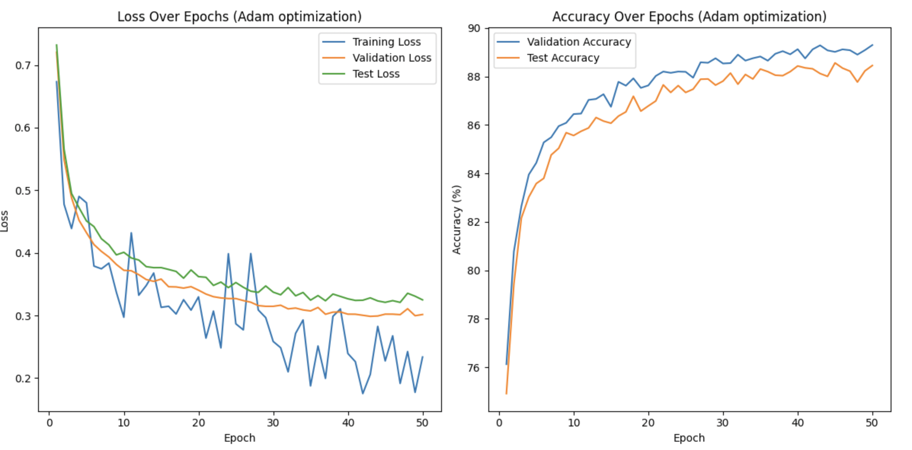
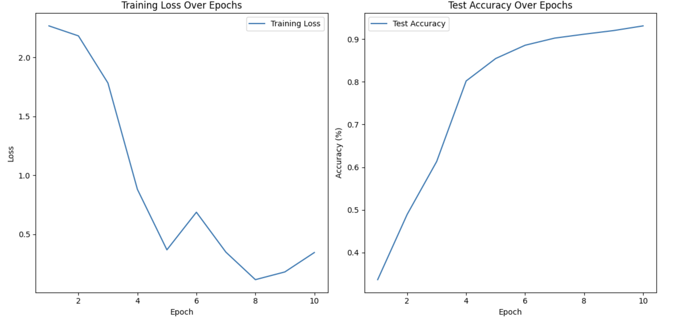
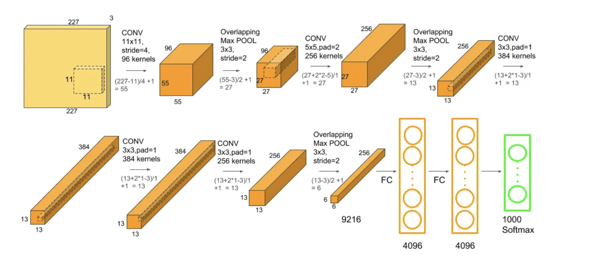

# Neural-Network-Architectures-for-FashionMNIST-Classification

This repository contains code and documentation for solving image classification tasks using various neural network architectures.

## Project Overview

In this project, our objective is to train different neural network architectures (FCNs, DNNs, CNNs) for image classification using the FashionMNIST dataset. We are tasked with:

- Determining the architecture of our models.
- Fine-tuning hyperparameters for optimal performance.
- Comparing the performance of different models against each other.

## Documentation

You can find the detailed documentation in the PDF below:

[Project Paper](./Neural%20Network%20Architectures%20for%20FashionMNIST%20Classification_KutayDemiralay.pdf)

## Code

You can find the relevant Python codes below:

[View the Project Code](./Neural_Network_Architectures_for_FashionMNIST_Classification_KutayDemiralay.ipynb)

## Results

 Plots of loss over epochs and accuracy through epochs for training, validation, and testing were generated. From these values, the optimal network for classifying the FashionMNIST dataset was chosen across various architectures, optimizers, initialization techniques, regularizations, and normalizations.

The Adam optimizer, with an appropriate learning rate, Kaiming Uniform initialization, and batch normalization proved to be the most effective for our base model with FCN  neural network architecture, even though it exhibited some underfitting characteristics

*Figure 1: Plots of loss over epochs and accuracy through epochs Base Model with Adam Optimizer with  Kaiming Uniform initialization, and batch normalization*

But when I used the AlexNet CNN architecture for classifying the same FashionMNIST dataset, I achieved significantly better classification performance. The testing accuracy with AlexNet CNN reached up to 93.14% in only 10 epochs, whereas with FCN, the highest testing accuracy I could achieve was 88.46% in 50 epochs, even with optimal tuning.

*Figure 2: Plots of loss over epochs and accuracy through epochs with AlexNet CNN architecture*

*Figure 3:AlexNet CNN architecture explained [2]*
